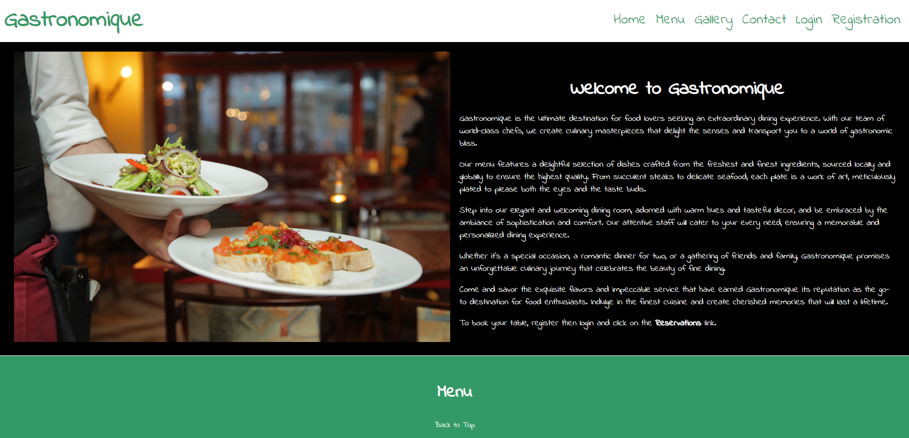
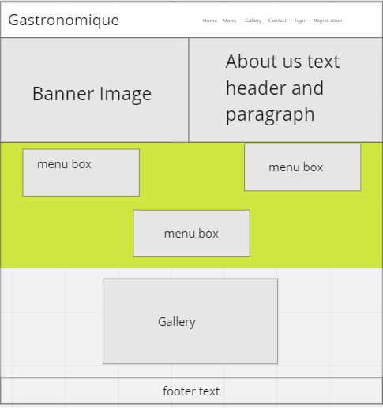
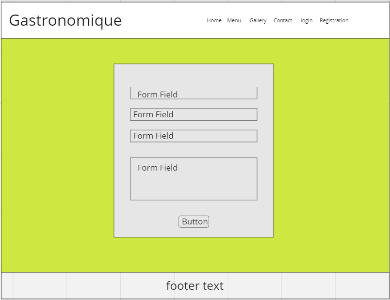
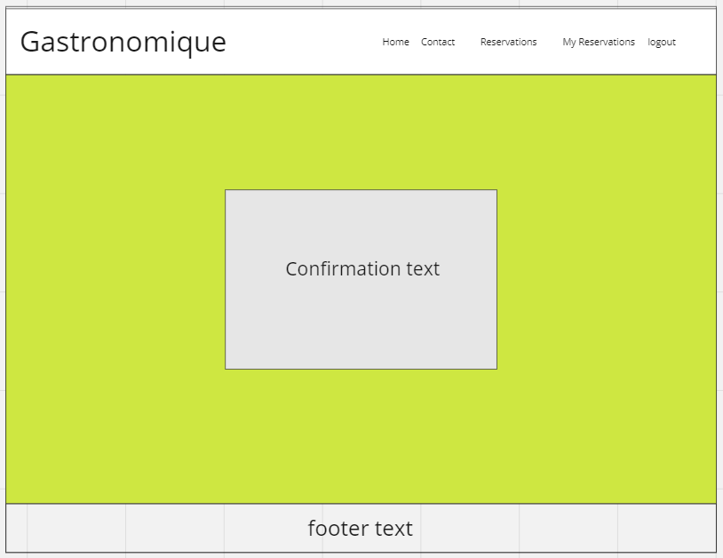
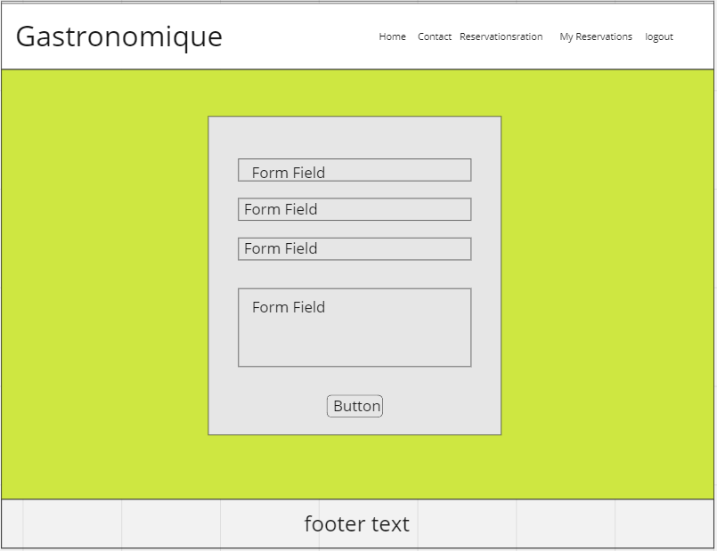
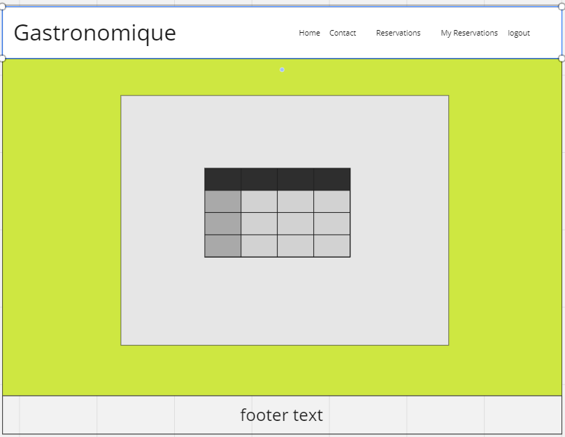
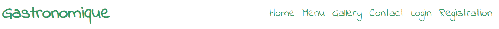
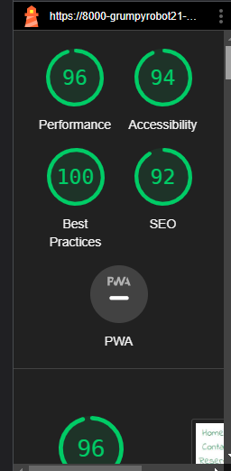
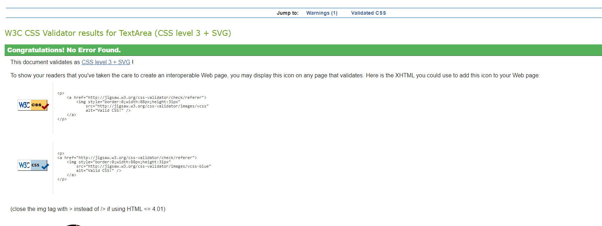

# Gastronomique -Restaurant Booking System

## Introduction
This is my fourth project. This project is a restaurant (Gastronomique) booking system, allowing users to make a reservation. This application uses the following languages: Django, Python, HTML, CSS and JavaScript.

This project demonstrates CRUD functionality (Create, Read, Update, Delete). The user is able to create, read, update and delete their reservation as well as create a profile and login/logout of the site.

No site is currently publicly available as was unable to get the application running in heroku successfully in the remaining project time available.

<p align="center">
  </p>

# Table of Contents

-   [1. UX](#ux)
    -   [1.1. Strategy](#strategy)
        -   [Project Goals](#project-goals)
            -   [User Goals:](#user-goals)
            -   [User Expectations:](#user-expectations)
            -   [Trends of Modern Websites](#trends-of-modern-websites)
            -   [Strategy Table](#strategy-table)
    -   [1.2. Structure](#structure)
    -   [1.3. Skeleton](#skeleton)
    -   [1.4. Surface](#surface)
-   [2. Features](#features)
-   [3. Technologies Used](#technologies-used)
-   [4. Testing](#testing)
-   [5. Development Cycle](#development-cycle)
-   [6. Deployment](#deployment)
-   [7. Known Bugs](#known-bugs)
-   [8. Credits](#credits)

<a name="ux"></a>

# 1. UX

[Go to the top](#table-of-contents)

A simple online booking system makes ging to a restaurant a stress free and enjoyable experience.

This project provides diners with a simplea and easy way to creat a user profile, make a reservation, update a reservation and delete a reservation. It has used defensive programming techniques to protect user details and data from unscrupulous parties.

<a name="strategy"></a>

## 1.1. Strategy

[Go to the top](#table-of-contents)

### Goals
The project goals are to allow the user to be able to sign up, sign in/out, create a user profile and create/update/delete a reservation easily via this application.

### User Goals:
First Time Visitor.
-   As a first-time visitor, I want to make a reservation at my preferred date and time.
-   As a first-time visitor, I want to view the menu for the restaurant.
-   As a first-time visitor, I want to be able to easily contact the restaurant.
-   As a first time visitor, I want to be able to easily create a user account to access my private reservation information.

Returning Visitor Goals
-   As a Returning visitor, I want to be able to log in and out of my user account.
-   As a Returning Visitor, I want to update my reservation.
-   As a Returning Visitor, I want to cancel my reservation.

Frequent User Goals
-   As a Frequent User, I want to see if the menu has been changed and view the gallery.

### User Expectations:
The application should provide a simple user interface, with clear and concise site navigation.

-   The menu is easy to locate and easy to read.
-   The site is easy to navigate.
-   The website is fully responsive.
-   There is a clear way to contact the restaurant.

### User Stories
Throughout the project I used the GitHub projects board to log all user stories as my project management tool. This helped me keep focus on the necesarry tasks as I would move them to the "in progress lane" as I'm working on the story. I would then move them to the "done" lane once the story has been completed.


### Strategy Table
Opportunity/Problem/Feature| Importance| Viability/Feasibility
------------ | -------------------------|---------
Display a Menu | 5 | 5
Account signup | 5 | 5
User profile | 1 | 4
Responsive design | 5 | 5
Contact form | 5 | 5
Ability to create a booking | 5 | 5
Ability to update a booking | 5 | 5
Ability to cancel a booking | 5 | 5
Multiple table occupancies | 1 |4
Avoid double bookings | 1 | 5

Total | 38 | 48

## Scope
I was not able to include all of the features from the above table. As a result the project has been designed in it's first incarnation as a minimum viable product. Please find below the design parameters and ideas to include in a future phase.

### Minimum viable product - Basic functionality
- Display a menu
- Allow users to register for an account
- Allow users to log in and out of their account
- Responsive design
- Contact form
- Ability to create a reservation
- Ability to update a reservation
- Ability to cancel a reservation

### Future functionality to add
- Multiple table occupancies
- Avoid double bookings
- Contact form model, so messages are saved to the database
- Email confirmation when a message has been received.
- Account email verification
- Allow users to create and edit a personal profile

<a name="structure"></a>

## 1.2. Structure

[Go to the top](#table-of-contents)

A key component is to have responsive design in this project as most users access applications on multiple device types (mobile, tablet, laptop/PC). This application has been designed to be:

- Responsive on all device sizes
- Easily navigated through clear labelling and uncluttered design
- All elements share a consistent style including font size, font family, colour schemes etc.

### Database Model

Final database structure:

```python
class Reservations(models.Model):
    """Reservations model definitions"""
    user = models.ForeignKey(User, on_delete=models.CASCADE)
    name = models.CharField(max_length=100)
    phone = models.CharField(max_length=20)
    email = models.EmailField(max_length=100)
    date = models.DateField()
    time = models.TimeField()
    guests = models.PositiveIntegerField()

    def __str__(self):
        return self.name
```

<a name="skeleton"></a>

## 1.3. Skeleton

[Go to the top](#table-of-contents)

### Wire-frames

Home Page:
<p align="center">
  </p>

Conatct Page:
<p align="center">
  </p>

Thank you for message Page:
<p align="center">
  </p>

Registration Page:
<p align="center">
  </p>

Login Page:
<p align="center">
  </p>

Reservation created successfully Page:
<p align="center">
  </p>

My Reservations page:
<p align="center">
  </p>

Make a Reservation Page:
<p align="center">
  </p>


<a name="surface"></a>

## 1.4. Surface

[Go to the top](#table-of-contents)

### Colours

I used the following colors in my design to keep the overall layout simple and cler: #339966, #fff, #00ced1, #000000 .

### Typography

I decided to use Indie Flower as my font of choice with sans serif as my backup font for browsers that might not support Be Vietnam Pro.

The link to the font can be found [here](https://fonts.google.com/specimen/Indie+Flower/about).

<a name="features"></a>

# 2. Features

[Go to the top](#table-of-contents)

### All Pages
- The navigation bar is at the top of all the pages. The navigation bar is dynamic so that depending whether or not the user is logged in, the options will change.
- If the user is not logged in the navigation bar will look like this:
<p align="center">
  </p>
- If the user is logged in the navigation bar will look like this:
<p align="center">
  </p>
- The footer is placed at the bottom of each page.
- The restaurant name is placed at the top of all pages. It performs no additional function due to the inclusion of a home button in the navigation links. It dissappears on mobile screes to accomodate the navbar links.

### Registration Page
- A simple signup form that requires the user to enter a unique username, email address and password. The password must be entered again for confirmation, this must match the already entered password above.
- If the user enters an email address that has already been registered, the user is prompted by an error message.
- If the user enters a password that is not secure, the user will be prompted by a message.
- If the user enters both passwords that do not match, the user is prompted by a message.
- Once the user has successfully signed up, they will be directed to the make a reservation page.

### Login Page
- A login form that requires the user to enter their email address and password that they used when signing up to the site.

### Logout Page
- When clicking logout from the navigation bar, the user is redirected to the home page.

### Home Page
- A simple but elegant banner to give the user a sense of the restaurant with an image and about us text.
-A menu with a nav link in the navbar to take user straigh to this infomration. There is a back to top of page link for the user once they have read the menu.
- A gallery section with enticing picture of the restaurant food offereings. There is a back to top of page link for the user once they have read the menu.

### Contact Page
- This perovides users with the ability to contact the restaurant voa a contact form. This will provide error messages when incorrect data is entered and has a message sent confirmation screen once the message has been submitted by the user.

### Reservations Page
- This allows the user to create a reservation on their preferred date and time. If oncirrect data is entered they will receive an error message. They are directed to a reservation confirmation page once their reservation has been successfully submitted and are then asked to navigate to the reservation list page.

### My Reservations Page
- Thsi provides the user with a list of their confirmed reservations. It provides them with the option to delete their reservation or update their reservation. 

### Delete Reservation
-This page confirms that the user wishes to truly delete their reservation or cancel that decision. Two buttons are provided. Idf deleted the user is taken back to their reservation list which will now not display the deleted reservation. If there sre no reservations left it will display a no reservations found message.

### Update reservation
- The user is taken to their reservation detaisl where they can change any part of the stored data. Once completed they are taken back to their reservation list page and they will see the confirmed changes made to their reservation.

<a name="technologies-used"></a>

## 3. Technologies Used

[Go to the top](#table-of-contents)

-   [HTML5](https://en.wikipedia.org/wiki/HTML) (Programming Language)
    
-   [CSS3](https://en.wikipedia.org/wiki/CSS) (Programming Language)
    
-   [JavaScript](https://en.wikipedia.org/wiki/JavaScript) (Programming language)
    
-   [Python](https://en.wikipedia.org/wiki/Python_(programming_language))
    
-   [PostgreSQL](https://www.postgresql.org/) Database

-   [Django](https://www.djangoproject.com/) Framework
    
-   [Gitpod](https://www.gitpod.io/) Code environment
    
-   [Chrome](https://www.google.com/intl/en_uk/chrome/) Debugging
    
-   [Miro](https://miro.com/) Wireframes
       
-   [Google Fonts](https://fonts.google.com/)
    
-   [GitHub](https://github.com/) Repository
   

<a name="testing"></a>

# 4. Testing

[Go to the top](#table-of-contents)

### Google Developer Tools
Developer tools enabled me to establish which parts of my code were not working and to try options out before settling on my chosen solution. 

I checked the accessibility of the page using lighthouse. 
<p align="center">
  </p>

### Responsive Tools
I used [Am I Responsive](http://ami.responsivedesign.is) to make sure that all my pages are responsive to all devices. Unable to complete this as heroku deplopyment failed.

### W3C Validator Tools


I used 
<p align="center">
  </p> to check for any errors within my CSS stylesheet.

I had no errors in my CSS file:


### JavaScript:
I used [JS Hint](https://jshint.com/) to check for any errors within my JavaScript script tags. 

I had no errors in my JavaScript files:


### Python:
I used [Pylint](https://pypi.org/project/pylint/) pep8 validator to check for any errors within my Python files inside the IDE. The validator showed multiple "line too long" errors. This was rectified by adding each statement as a new line.

There were also "line too long" errors within my settings.py file but I have chosen to ignore these as this is a very important file and despite trying to rectify these errors I was unsuccessful.

## Manual Testing
I have tested my site on Safari and google chrome on multiple devices.

These include:
-   Dell Inspiron 15 Laptop
-   Samsung Galaxy S20 FE


Please find below my testing process for all pages via mobile and web:

### Navigation Bar

All Pages:
TEST            | OUTCOME                          | PASS / FAIL  
--------------- | -------------------------------- | ---------------
Home page | When clicking the "home" link in the navigation bar, the browser redirects me to the home page. The active styling will turn the menu text turquoise when hovered over. | PASS
Menu section | When clicking the "menu" link in the navigation bar, the browser redirects me to the menu section. The active styling will turn the menu text turquoise when hovered over. | PASS
Gallery section | When clicking the "Gallery" link in the navigation bar, the browser redirects me to the interactive gallery section. The active styling will turn the menu text turquoise when hovered over. | PASS
Contact page | When clicking the "contact" link in the navigation bar, the browser redirects me to the contact page. The active styling will turn the menu text turquoise when hovered over. | PASS
Message sent confirmation | When clicking the "submit" button in the contact page, the browser redirects me to the message sent confirmation page. The active styling will turn the menu text turquoise when hovered over.| PASS
Login page | When clicking the "Login" link in the navigation bar, the browser redirects me to the Login page. The active styling will turn the menu text turquoise when hovered over.| PASS
Registration page | When clicking the "Regiatration" link in the navigation bar, the browser redirects me to the user registration page. The active styling will turn the menu text turquoise when hovered over. | PASS
Reservations page | When clicking the "Reservations" link in the navigation bar, the browser redirects me to the make a reservation page. The active styling will turn the menu text turquoise when hovered over.| PASS
My reservations page | When clicking the "My Reservations" link in the navigation bar, the browser redirects me to the reservation list page. The active styling will turn the menu text turquoise when hovered over.| PASS
Logout link | When clicking the "Logou" link in the navigation bar, the browser redirects me to the Home page. The active styling will turn the menu text turquoise when hovered over.| PASS
Reservation confirmation | When clicking the "submit" button in the reservations page, the browser redirects me to the reservation booking successful page. The active styling will turn the menu text turquoise when hovered over.| PASS

### Home page
TEST            | OUTCOME                          | PASS / FAIL  
--------------- | -------------------------------- | ---------------
Media | All media assets are displayed properly, have no pixelation or stretched images and is responsive on all devices. | PASS
Responsiveness | Check every element on the page for consistent scalability in mobile, tablet and desktop view.| PASS
Accessibility | 

### Contact page
TEST            | OUTCOME                          | PASS / FAIL  
--------------- | -------------------------------- | ---------------
Media | All media assets are displayed properly, have no pixelation or stretched images and is responsive on all devices. | PASS
Responsiveness | Check every element on-page for consistent scalability in mobile, tablet and desktop view.| PASS
Submit button | When clicking the book now button on the page, the browser redirects to the booking page. | PASS
Accessibility | Contact Form | Checked the form submits only when all fields are filled out. | PASS


### Reservations page
TEST            | OUTCOME                          | PASS / FAIL  
--------------- | -------------------------------- | ---------------
Media | All media assets are displayed properly, have no pixelation or stretched images and is responsive on all devices. | PASS
Responsiveness | Check every element on-page for consistent scalability in mobile, tablet and desktop view.| PASS
Submit Button | When clicking the Submit button on the page, the browser redirects to the reservation was successful page. | PASS
Accessibility | Booking Form | Checked the form submits only when all required fields are filled out. | PASS
If not signed in | Checked to see if the user has not signed in the booking form should not show and directed to signup/sign-in first. | PASS 
Form validation |Checked that the telephone number input only allows number input and not any text | PASS

### Registration page
TEST            | OUTCOME                          | PASS / FAIL  
--------------- | -------------------------------- | ---------------
Media | All media assets are displayed properly, have no pixelation or stretched images and is responsive on all devices. | PASS
Responsiveness | Check every element on-page for consistent scalability in mobile, tablet and desktop view.| PASS
Accessibility | Registration Form | Checked the form submits only when all required fields are filled out. | PASS
Register form | Checked the form submits only when all required fields are filled out. | PASS
Log in | Checked the page redirects to the Log-in page. | PASS


### Update Reservation page
TEST            | OUTCOME                          | PASS / FAIL  
--------------- | -------------------------------- | ---------------
Media | All media assets are displayed properly, have no pixelation or stretched images and is responsive on all devices. | PASS
Responsiveness | Check every element on-page for consistent scalability in mobile, tablet and desktop view.| PASS
Accessibility | Update button | Checked that the button redirects to the edit reservations page with the correct booking instance. | PASS
Cancel reservation button | Checked that the button redirects to the cancel booking page with the correct booking instance. | PASS

### Delete Registration page
TEST            | OUTCOME                          | PASS / FAIL  
--------------- | -------------------------------- | ---------------
Media | All media assets are displayed properly, have no pixelation or stretched images and is responsive on all devices. | PASS
Responsiveness | Check every element on-page for consistent scalability in mobile, tablet and desktop view.| PASS
Accessibility | Checked the accessibility of the page using lighthouse| PASS
Register form | Checked the form submits only when all required fields are filled out. | PASS
Sign in link | Checked the sign-in link redirects to the sign-in page. | PASS

### Log in page
TEST            | OUTCOME                          | PASS / FAIL  
--------------- | -------------------------------- | ---------------
Media | All media assets are displayed properly, have no pixelation or stretched images and is responsive on all devices. | PASS
Responsiveness | Check every element on-page for consistent scalability in mobile, tablet and desktop view.| PASS
Accessibility | Log in form | Checked the form submits only when all required fields are filled out. | PASS
Signup link | Checked the login link redirects to the reservations page. | PASS

<a name="development-cycle"></a>

# 5. Development Cycle

[Go to the top](#table-of-contents)

## Project Checklist
- Install Django and the supporting libraries
    - Install Django and Gunicorn. Gunicorn is the server I am trying to get to run Django on Heroku.
    - Install support libraries including psycopg2, this is used to connect the Elephant PostgreSQL database
    - Install Cloudinary libraries, this is a host provider service that stores static files for the project
    - Create the requirements.txt file. This includes the project's dependencies allowing us to run the project in Heroku.

- Create a new, blank Django Project
    - Create a new project
    - Create the app
    - Add restaurant_booking to the installed apps in settings.py
    - Migrate all new changes to the database
    - Run the server to test

- Setup project to use Cloudinary and PostgreSQL
    - Create new Heroku app
        - Sign into Heroku
        - Select New
        - Select create new app
        - Enter a relevant app name
        - Select appropriate region
        - Select the create app button

    - Attach PostgreSQL database
        - In Heroku go to resources
        - Search for Postgres in the add-ons box
        - Select Heroku Postgres
        - Submit order form

    - Prepare the environment and settings.py file
        - Create env.py file
        - Add DATABASE_URL with the Postgres URL from Heroku
        - Add SECRET_KEY with a randomly generated key
        - Add SECRET_KEY and generated key to the config vars in Heroku
        - Add if statement to settings.py to prevent the production server from erroring
        - Replace insecure key with the environment variable for the SECRET_KEY
        - Add Heroku database as the back end
        - Migrate changes to new database

    - Get static media files stored on Cloudinary
        - Create a Cloudinary account
        - From the dashboard, copy the API Environment variable
        - In the settings.py file create a new environment variable for CLOUDINARY_URL
        - Add the CLOUDINARY_URL variable to Heroku
        - Add a temporary config var for DISABLE_COLLECTSTATIC
        - In settings.py add Cloudinary as an installed app
        - Add static and media file variables
        - Add templates directory
        - Change DIR's key to point to TEMPALTES_DIR
        - Add Heroku hostname to allowed hosts
        - Create directories for media, static and templates in the project workspace
        - Create a Procfile

- Deploy new empty project to Heroku - not successful

- Employ agile prwcties by ustilising project kanban board and loggin issues
<p align="center">
  </p>


<a name="deployment"></a>

# 6. Deployment

[Go to the top](#table-of-contents)

I used the terminal to deploy my project locally. To do this I had to:
1. Create a repository on GitHub.
2. Clone the repository on your chosen source code editor (GitPod in my case) using the clone link.
3. Open the terminal within GitPod
4. Enter "python3 manage.py runserver into the terminal.
5. Go to local host address on my web browser.
6. All locally saved changes will show up here.

For the final deployment to Heroku, I unsuccessfully tried to:
1. Uncomment the PostgreSQL databse from my settings.py file.
2. Set debug = False in my settings.py file.
3. Commit and push all files to GitHub
3. In Heroku, remove the DISABLE_COLLECTSTATIC config var.
4. In the deploy tab, go to the manual deploy sections and click deploy branch.

I had an issue with the deployed site and the CSS was not showing on my screen.
I could not rectify the issue preventing me from running the application successfull;y innHeroku due to extreme time limitations.


<a name="known-bugs"></a>

# 8. Known Bugs

[Go to the top](#table-of-contents)

- Heroku deployment has failed. Further analysis is required to figure out and remedy the issues.

<a name="credits"></a>

# 9. Credits

[Go to the top](#table-of-contents)


### Content
-   All images came from Pexels - https://www.pexels.com/
### Project Acknowledgements
- Code Institue Tutor Support - For directing me to the correct solutions for many bugs.

- My Mentor Marcel - For his constructive criticism and always pushing me to go further to develop my skills, being supportive and knowledgable.